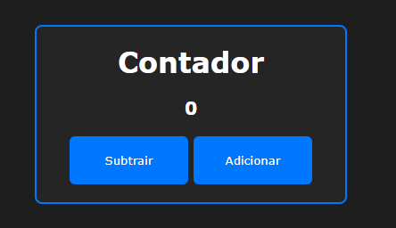

# contador
Projeto desenvolvido com base em um contador comum, com funções de aumentar e diminuir.

## 🚀 Tecnologias

Esse projeto foi desenvolvido com as seguintes tecnologias:
- HTML
- CSS
- JavaScript

## 📚 Bibliotecas:
- [JavaScript](https://developer.mozilla.org/pt-BR/docs/Web/JavaScript)

## 💻 Projeto

[Clique aqui para acessar]()
> **Objetivo:** Criar um contador com JavaScript.
