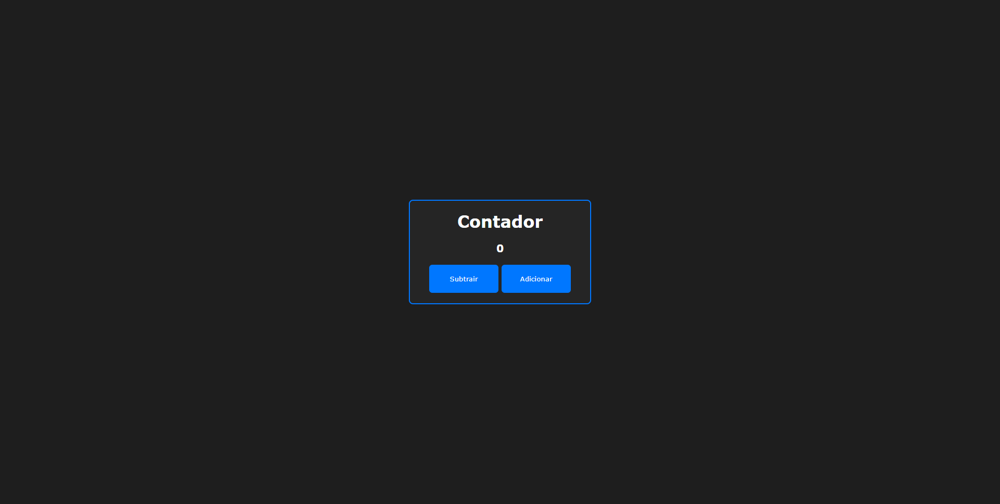

# contador
Project developed is a simple counter with functions to increase and decrease.

## 🚀 Technologies
This project was developed with the following technologies:
- HTML
- CSS
- JavaScript

## 📚 Libraries
- [JavaScript](https://developer.mozilla.org/pt-BR/docs/Web/JavaScript)

## 💻 Project

[Clique aqui para acessar](https://contador-lime.vercel.app/)
> **Objetivo:** Create a counter.
